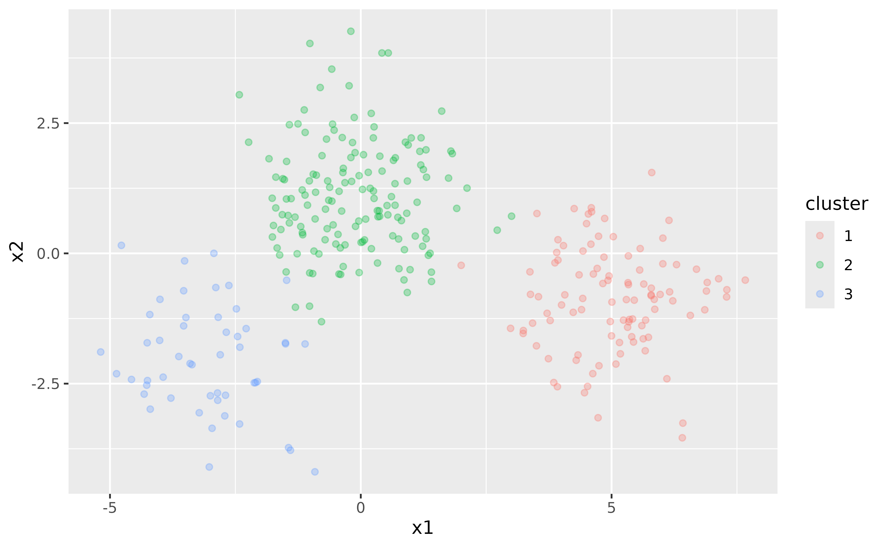
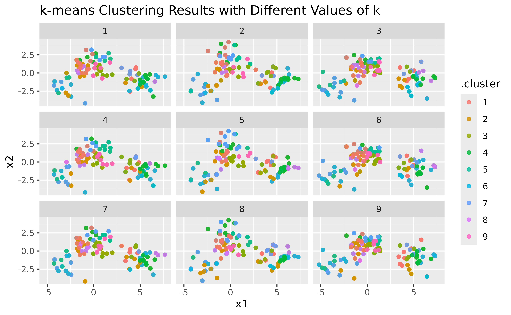
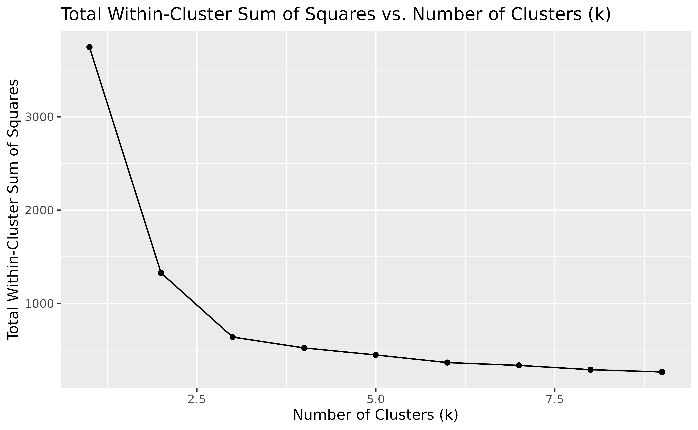
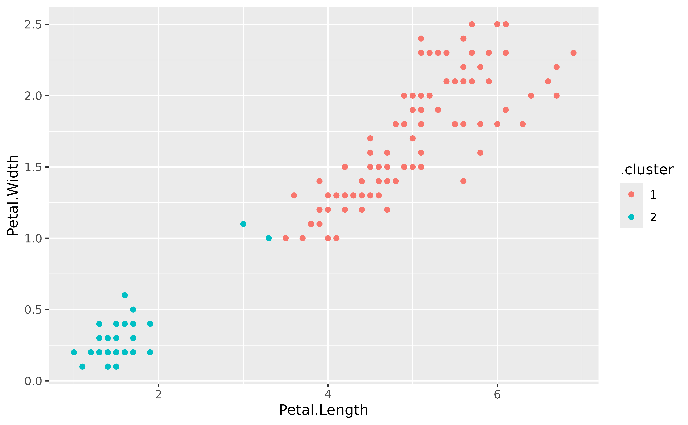

# Why G-means?

We’ll start by loading the necessary libraries:

``` r

library(broom)
library(data.table)
library(ggplot2)
library(gmeans)
```

## Overview

To illustrate the purpose of the G-means algorithm, let’s start with an
adapted k-means clustering example from the
[tidymodels](https://www.tidymodels.org/learn/statistics/k-means/)
website. This example shows the challenge of determining the number of
clusters (`k`) in clustering analysis. Throughout this vignette, we will
use `data.table` for data manipulation, and the
[`tidy()`](https://generics.r-lib.org/reference/tidy.html),
[`augment()`](https://generics.r-lib.org/reference/augment.html), and
[`glance()`](https://generics.r-lib.org/reference/glance.html) generics
for handling model output. The `broom` package provides methods for
`kmeans` objects, and `gmeans` provides methods for its own objects.

We begin by generating some random two-dimensional data that naturally
forms three clusters. Each cluster’s data comes from a different
multivariate Gaussian distribution with unique means:

``` r

set.seed(27)

centers <- data.table(
  cluster = factor(1:3),
  num_points = c(100, 150, 50),
  x1 = c(5, 0, -3),
  x2 = c(-1, 1, -2)
)
points <- centers[,
  .(
    x1 = rnorm(num_points, mean = x1),
    x2 = rnorm(num_points, mean = x2)
  ),
  by = cluster
]

ggplot(points, aes(x1, x2, color = cluster)) +
  geom_point(alpha = 0.3)
```



In this simple example, we know that there are three clusters. However,
in real-world scenarios, the number of clusters is often unknown and
must be determined as part of the analysis.

## Challenges with k-means

k-means clustering requires specifying the number of clusters, `k`,
beforehand. To illustrate this, let’s fit a k-means model with `k = 3`:

``` r

points <- points[, cluster := NULL]
kclust <- kmeans(points, centers = 3)
```

Here, we fit the k-means model with the correct number of clusters
because we know the true structure of the data. However, this knowledge
is often not available in practice.

To explore the effect of different `k`, we can fit k-means models with
varying numbers of clusters and visualize the results. To make handling
the k-means output easier, we use the
[`tidy()`](https://generics.r-lib.org/reference/tidy.html),
[`augment()`](https://generics.r-lib.org/reference/augment.html), and
[`glance()`](https://generics.r-lib.org/reference/glance.html) methods
for `kmeans` objects from the `broom` package.

The [`augment()`](https://generics.r-lib.org/reference/augment.html)
function adds the cluster assignments to the original dataset, allowing
us to see how each data point is classified:

``` r

augment(kclust, points)
#> # A tibble: 300 × 3
#>       x1      x2 .cluster
#>    <dbl>   <dbl> <fct>   
#>  1  6.91 -0.558  3       
#>  2  6.14  0.634  3       
#>  3  4.24 -1.13   3       
#>  4  3.54 -0.832  3       
#>  5  3.91  0.0169 3       
#>  6  5.30 -0.887  3       
#>  7  5.01 -0.935  3       
#>  8  6.16 -0.739  3       
#>  9  7.13 -0.487  3       
#> 10  5.24 -1.28   3       
#> # ℹ 290 more rows
```

The [`tidy()`](https://generics.r-lib.org/reference/tidy.html) function
provides a per-cluster summary, displaying the cluster centers, sizes,
and within-cluster sum of squares:

``` r

tidy(kclust)
#> # A tibble: 3 × 5
#>       x1     x2  size withinss cluster
#>    <dbl>  <dbl> <int>    <dbl> <fct>  
#> 1 -0.128  1.14    146     307. 1      
#> 2 -2.94  -1.99     53     119. 2      
#> 3  5.02  -0.864   101     214. 3
```

To obtain a single-row summary with overall metrics such as total sum of
squares and the number of iterations, use the
[`glance()`](https://generics.r-lib.org/reference/glance.html) function:

``` r

glance(kclust)
#> # A tibble: 1 × 4
#>   totss tot.withinss betweenss  iter
#>   <dbl>        <dbl>     <dbl> <int>
#> 1 3746.         640.     3106.     2
```

Using these methods, we can easily extract and manipulate the results of
k-means clustering for different values of `k`:

``` r

kclusts <- data.table(k = 1:9)
kclusts[, kclust := lapply(k, \(x) kmeans(points, x))]
kclusts[, let(
  tidied = lapply(kclust, tidy),
  glanced = lapply(kclust, glance),
  augmented = lapply(kclust, augment, points)
)]

clusters <- kclusts[, .(k, rbindlist(tidied))]
assignments <- kclusts[, .(k, rbindlist(augmented))]
clusterings <- kclusts[, .(k, rbindlist(glanced))]

p1 <- ggplot(assignments, aes(x = x1, y = x2)) +
  geom_point(aes(color = .cluster), alpha = 0.8) +
  facet_wrap(~k) +
  labs(title = "k-means Clustering Results with Different Values of k")
p1
```



## Visualizing cluster centers

To enhance the visualization, let’s add cluster centers:

``` r

p2 <- p1 +
  geom_point(data = clusters, size = 10, shape = "x") +
  labs(title = "k-means Clustering with Centers")
p2
```


## Evaluating clustering performance

Finally, we can look at how the total within-cluster sum of squares
(WSS) changes with different values of `k`. This helps us see how well
the data is being clustered as `k` increases:

``` r

ggplot(clusterings, aes(k, tot.withinss)) +
  geom_line() +
  geom_point() +
  labs(
    title = "Total Within-Cluster Sum of Squares vs. Number of Clusters (k)",
    x = "Number of Clusters (k)",
    y = "Total Within-Cluster Sum of Squares"
  )
```



In general, the WSS decreases as the number of clusters k increases,
which is expected since having more clusters usually results in a better
fit. However, we often look for a point in the plot where the decrease
in WSS starts to slow down, creating a noticeable “elbow”. This elbow
suggests that adding more clusters beyond this point offers little
improvement, indicating a good number of clusters. In our example, this
bend is around `k = 3`, suggesting that three clusters capture the main
structure of the data effectively.

## Motivation for G-means

As seen from the plots, choosing the right number of clusters is not
straightforward. We could use metrics like WSS to help decide, but these
methods can be subjective and prone to error. This is where the G-means
algorithm comes in: it automatically determines the number of clusters
by assessing the data distribution within each cluster.

By using statistical hypothesis testing (the Anderson-Darling test in
our implementation), G-means provides a more robust and automated way to
find the “correct” number of clusters. In the next section, we’ll see
how to use G-means and explore its benefits over traditional k-means
clustering.

## G-means

Let’s now apply the G-means algorithm to the same data:

``` r

fit <- gmeans(points)
summary(fit)
#> G-means clustering with 3 clusters (k_init = 1, k_max = 10, level = 0.0001)
#> 
#>  cluster size withinss     x1     x2
#>        1  101      214  5.016 -0.864
#>        2  146      307 -0.128  1.137
#>        3   53      119 -2.943 -1.988
#> 
#> Total SS: 3746, within SS: 640, between SS: 3106 (82.9% of total)
```

As expected from our previous analysis, G-means identifies 3 clusters,
aligning with the elbow point observed in the WSS plot. No
[`set.seed()`](https://rdrr.io/r/base/Random.html) is needed: G-means
starts from a single center and splits it deterministically, so the
result does not depend on the random seed.

Next, let’s explore how G-means performs on a different dataset:

``` r

x <- as.matrix(iris[, -5])
gclust <- gmeans(x)
table(cluster = gclust$cluster, species = iris$Species)
#>        species
#> cluster setosa versicolor virginica
#>       1      0         47        50
#>       2     50          3         0
```

G-means finds two clusters: one with the setosa flowers, and one with
nearly all versicolor and virginica flowers. These two species overlap
so much in their measurements that together they still look Gaussian to
the test, so G-means does not split them.

`gmeans` ships its own
[`tidy()`](https://generics.r-lib.org/reference/tidy.html),
[`augment()`](https://generics.r-lib.org/reference/augment.html), and
[`glance()`](https://generics.r-lib.org/reference/glance.html) methods,
so the same workflow applies to the clustering results.

The [`augment()`](https://generics.r-lib.org/reference/augment.html)
function adds cluster assignments to the original dataset for easy
plotting:

``` r

augment(gclust, x) |>
  ggplot(aes(x = Petal.Length, y = Petal.Width)) +
  geom_point(aes(color = .cluster))
```



The [`tidy()`](https://generics.r-lib.org/reference/tidy.html) function
provides a summary of each cluster:

``` r

tidy(gclust)
#>   Sepal.Length Sepal.Width Petal.Length Petal.Width size withinss cluster
#> 1        6.301       2.887        4.959      1.6959   97   123.80       1
#> 2        5.006       3.370        1.560      0.2906   53    28.55       2
```

The [`glance()`](https://generics.r-lib.org/reference/glance.html)
function gives an overall summary of the model, including the number of
clusters found and the settings used to fit it:

``` r

glance(gclust)
#>   k k_init k_max level totss tot.withinss betweenss iter
#> 1 2      1    10 1e-04 681.4        152.3       529    1
```
