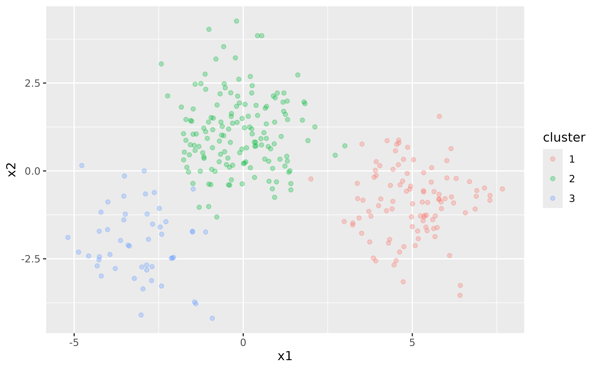
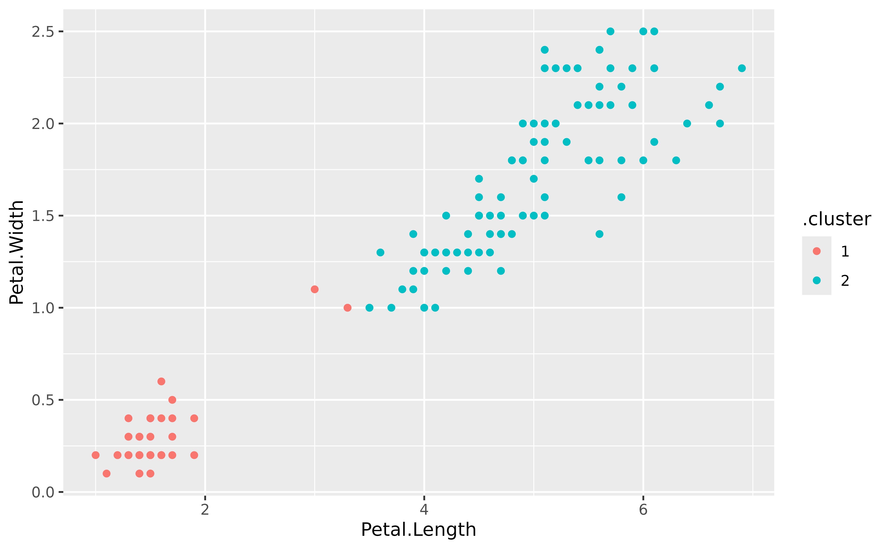

# Why G-means?

We’ll start by loading the necessary libraries:

``` r
library(data.table)
library(ggplot2)
library(gmeans)
```

## Overview

To illustrate the purpose of the G-means algorithm, let’s start with an
adapted k-means clustering example from the
[tidymodels](https://www.tidymodels.org/learn/statistics/k-means/)
website. This example shows the challenge of determining the number of
clusters (`k`) in clustering analysis. Throughout this vignette, we will
use `data.table` for data manipulation, and the custom `tidy`,
`augment`, and `glance` functions for handling model output, inspired by
the `broom` package functionality.

We begin by generating some random two-dimensional data that naturally
forms three clusters. Each cluster’s data comes from a different
multivariate Gaussian distribution with unique means:

``` r
set.seed(27)

centers <- data.table(
  cluster = factor(1:3),
  num_points = c(100, 150, 50),
  x1 = c(5, 0, -3),
  x2 = c(-1, 1, -2)
)
points <- centers[, .(
  x1 = rnorm(num_points, mean = x1),
  x2 = rnorm(num_points, mean = x2)
), by = cluster]

ggplot(points, aes(x1, x2, color = cluster)) +
  geom_point(alpha = 0.3)
```



In this simple example, we know that there are three clusters. However,
in real-world scenarios, the number of clusters is often unknown and
must be determined as part of the analysis.

## Challenges with k-means

k-means clustering requires specifying the number of clusters, `k`,
beforehand. To illustrate this, let’s fit a k-means model with `k = 3`:

``` r
points <- points[, cluster := NULL]
kclust <- kmeans(points, centers = 3)
kclust
#> K-means clustering with 3 clusters of sizes 146, 53, 101
#> 
#> Cluster means:
#>           x1         x2
#> 1 -0.1277535  1.1366932
#> 2 -2.9430301 -1.9877357
#> 3  5.0156304 -0.8637111
#> 
#> Clustering vector:
#>   [1] 3 3 3 3 3 3 3 3 3 3 3 3 3 3 3 3 3 3 3 3 3 3 3 3 1 3 3 3 3 3 3 3 3 3 3 3 3
#>  [38] 3 3 3 3 3 3 3 3 3 3 3 3 3 3 3 3 3 3 3 3 3 3 3 3 3 3 3 3 3 3 3 3 3 3 3 3 3
#>  [75] 3 3 3 3 3 3 3 3 3 3 3 3 3 3 3 3 3 3 3 3 3 3 3 3 3 3 1 1 1 1 1 1 1 1 1 1 1
#> [112] 1 1 1 1 1 1 1 1 1 1 1 1 3 1 1 1 1 1 1 1 1 1 1 1 1 1 1 1 1 2 1 1 1 1 1 1 1
#> [149] 1 1 1 1 1 1 3 1 1 1 1 1 1 1 1 1 1 1 1 1 1 1 1 1 1 1 1 1 1 1 1 1 1 1 1 1 1
#> [186] 1 1 1 1 1 1 1 1 1 1 1 1 1 1 1 1 1 1 1 1 1 1 1 1 1 1 1 1 1 1 1 1 1 1 1 1 1
#> [223] 1 1 1 1 1 1 1 1 1 1 1 1 1 1 2 1 1 1 1 1 1 1 2 1 1 1 1 1 2 2 2 2 2 2 2 2 2
#> [260] 2 2 2 2 2 2 2 2 2 2 2 2 2 2 2 2 2 2 2 2 2 2 2 2 2 2 2 2 2 2 2 2 2 2 2 2 2
#> [297] 2 2 2 2
#> 
#> Within cluster sum of squares by cluster:
#> [1] 307.3195 119.2575 213.5906
#>  (between_SS / total_SS =  82.9 %)
#> 
#> Available components:
#> 
#> [1] "cluster"      "centers"      "totss"        "withinss"     "tot.withinss"
#> [6] "betweenss"    "size"         "iter"         "ifault"
```

Here, we fit the k-means model with the correct number of clusters
because we know the true structure of the data. However, this knowledge
is often not available in practice.

To explore the effect of different `k`, we can fit k-means models with
varying numbers of clusters and visualize the results. To make handling
the k-means output easier, we define `tidy`, `augment`, and `glance`
functions that mimic the functionality of the `broom` package:

``` r
`%||%` <- function(x, y) if (!is.null(x)) x else y

tidy <- function(x, col.names = colnames(x$centers)) {
  col.names <- col.names %||% paste0("x", seq_len(ncol(x$centers)))
  dt <- as.data.table(x$centers)
  setnames(dt, col.names)
  dt[, let(
    size = x$size,
    withinss = x$withinss,
    cluster = factor(seq_len(.N))
  )][]
}

augment <- function(x, data) {
  if (inherits(data, "matrix") && is.null(colnames(data))) {
    colnames(data) <- paste0("X", seq_len(ncol(data)))
  }
  dt <- as.data.table(data)
  dt[, .cluster := as.factor(x$cluster)][]
}

glance <- function(x) {
  as.data.table(x[c("totss", "tot.withinss", "betweenss", "iter")])
}
```

The `augment()` function adds the cluster assignments to the original
dataset, allowing us to see how each data point is classified:

``` r
augment(kclust, points)
#>             x1         x2 .cluster
#>          <num>      <num>   <fctr>
#>   1:  6.907163 -0.5580268        3
#>   2:  6.144877  0.6338766        3
#>   3:  4.235469 -1.1313761        3
#>  ---                              
#> 298: -3.486164 -1.2307705        2
#> 299: -1.439651 -3.7284605        2
#> 300: -3.531135 -0.7172739        2
```

The `tidy()` function provides a per-cluster summary, displaying the
cluster centers, sizes, and within-cluster sum of squares:

``` r
tidy(kclust)
#>            x1         x2  size withinss cluster
#>         <num>      <num> <int>    <num>  <fctr>
#> 1: -0.1277535  1.1366932   146 307.3195       1
#> 2: -2.9430301 -1.9877357    53 119.2575       2
#> 3:  5.0156304 -0.8637111   101 213.5906       3
```

To obtain a single-row summary with overall metrics such as total sum of
squares and the number of iterations, use the `glance()` function:

``` r
glance(kclust)
#>       totss tot.withinss betweenss  iter
#>       <num>        <num>     <num> <int>
#> 1: 3746.156     640.1676  3105.989     2
```

Using these helper functions, we can easily extract and manipulate the
results of k-means clustering for different values of `k`:

``` r
kclusts <- data.table(k = 1:9)
kclusts[, kclust := lapply(k, \(x) kmeans(points, x))]
kclusts[, let(
  tidied = lapply(kclust, tidy),
  glanced = lapply(kclust, glance),
  augmented = lapply(kclust, augment, points)
)]

clusters <- kclusts[, .(k, rbindlist(tidied))]
assignments <- kclusts[, .(k, rbindlist(augmented))]
clusterings <- kclusts[, .(k, rbindlist(glanced))]

p1 <- ggplot(assignments, aes(x = x1, y = x2)) +
  geom_point(aes(color = .cluster), alpha = 0.8) +
  facet_wrap(~k) +
  labs(title = "k-means Clustering Results with Different Values of k")
p1
```


## Visualizing Cluster Centers

To enhance the visualization, let’s add cluster centers:

``` r
p2 <- p1 + geom_point(data = clusters, size = 10, shape = "x") +
  labs(title = "k-means Clustering with Centers")
p2
```


## Evaluating Clustering Performance

Finally, we can look at how the total within-cluster sum of squares
(WSS) changes with different values of `k`. This helps us see how well
the data is being clustered as `k` increases:

``` r
ggplot(clusterings, aes(k, tot.withinss)) +
  geom_line() +
  geom_point() +
  labs(
    title = "Total Within-Cluster Sum of Squares vs. Number of Clusters (k)",
    x = "Number of Clusters (k)",
    y = "Total Within-Cluster Sum of Squares"
  )
```


In general, the WSS decreases as the number of clusters k increases,
which is expected since having more clusters usually results in a better
fit. However, we often look for a point in the plot where the decrease
in WSS starts to slow down, creating a noticeable “elbow”. This elbow
suggests that adding more clusters beyond this point offers little
improvement, indicating a good number of clusters. In our example, this
bend is around `k = 3`, suggesting that three clusters capture the main
structure of the data effectively.

## Motivation for G-means

As seen from the plots, choosing the right number of clusters is not
straightforward. We could use metrics like WSS to help decide, but these
methods can be subjective and prone to error. This is where the G-means
algorithm comes in, it automatically determines the number of clusters
by assessing the data distribution within each cluster.

By using statistical hypothesis testing (the Anderson-Darling test in
our implementation), G-means provides a more robust and automated way to
find the “correct” number of clusters. In the next section, we’ll see
how to use G-means and explore its benefits over traditional k-means
clustering.

## G-means

Let’s now apply the G-means algorithm to the same data:

``` r
set.seed(123)

gmeans(points)
#> K-means clustering with 3 clusters of sizes 53, 146, 101
#> 
#> Cluster means:
#>           x1         x2
#> 1 -2.9430301 -1.9877357
#> 2 -0.1277535  1.1366932
#> 3  5.0156304 -0.8637111
#> 
#> Clustering vector:
#>   [1] 3 3 3 3 3 3 3 3 3 3 3 3 3 3 3 3 3 3 3 3 3 3 3 3 2 3 3 3 3 3 3 3 3 3 3 3 3
#>  [38] 3 3 3 3 3 3 3 3 3 3 3 3 3 3 3 3 3 3 3 3 3 3 3 3 3 3 3 3 3 3 3 3 3 3 3 3 3
#>  [75] 3 3 3 3 3 3 3 3 3 3 3 3 3 3 3 3 3 3 3 3 3 3 3 3 3 3 2 2 2 2 2 2 2 2 2 2 2
#> [112] 2 2 2 2 2 2 2 2 2 2 2 2 3 2 2 2 2 2 2 2 2 2 2 2 2 2 2 2 2 1 2 2 2 2 2 2 2
#> [149] 2 2 2 2 2 2 3 2 2 2 2 2 2 2 2 2 2 2 2 2 2 2 2 2 2 2 2 2 2 2 2 2 2 2 2 2 2
#> [186] 2 2 2 2 2 2 2 2 2 2 2 2 2 2 2 2 2 2 2 2 2 2 2 2 2 2 2 2 2 2 2 2 2 2 2 2 2
#> [223] 2 2 2 2 2 2 2 2 2 2 2 2 2 2 1 2 2 2 2 2 2 2 1 2 2 2 2 2 1 1 1 1 1 1 1 1 1
#> [260] 1 1 1 1 1 1 1 1 1 1 1 1 1 1 1 1 1 1 1 1 1 1 1 1 1 1 1 1 1 1 1 1 1 1 1 1 1
#> [297] 1 1 1 1
#> 
#> Within cluster sum of squares by cluster:
#> [1] 119.2575 307.3195 213.5906
#>  (between_SS / total_SS =  82.9 %)
#> 
#> Available components:
#> 
#> [1] "cluster"      "centers"      "totss"        "withinss"     "tot.withinss"
#> [6] "betweenss"    "size"         "iter"         "ifault"
```

As expected from our previous analysis, G-means identifies 3 clusters,
aligning with the elbow point observed in the WSS plot.

Next, let’s explore how G-means performs on a different dataset:

``` r
set.seed(1234)

x <- as.matrix(iris[, -5])
gclust <- gmeans(x)
```

Since
[`gmeans()`](https://m-muecke.github.io/gmeans/reference/gmeans.md) uses
[`stats::kmeans()`](https://rdrr.io/r/stats/kmeans.html) under the hood,
we can use our previously defined helper functions to analyze the
clustering results.

The `augment()` function adds cluster assignments to the original
dataset for easy plotting:

``` r
augment(gclust, x) |>
  ggplot(aes(x = Petal.Length, y = Petal.Width)) +
  geom_point(aes(color = .cluster))
```



The `tidy()` function provides a summary of each cluster:

``` r
tidy(gclust)
#>    Sepal.Length Sepal.Width Petal.Length Petal.Width  size  withinss cluster
#>           <num>       <num>        <num>       <num> <int>     <num>  <fctr>
#> 1:     5.005660    3.369811     1.560377    0.290566    53  28.55208       1
#> 2:     6.301031    2.886598     4.958763    1.695876    97 123.79588       2
```

The `glance()` function gives an overall summary of the model:

``` r
glance(gclust)
#>       totss tot.withinss betweenss  iter
#>       <num>        <num>     <num> <int>
#> 1: 681.3706      152.348  529.0226     1
```
