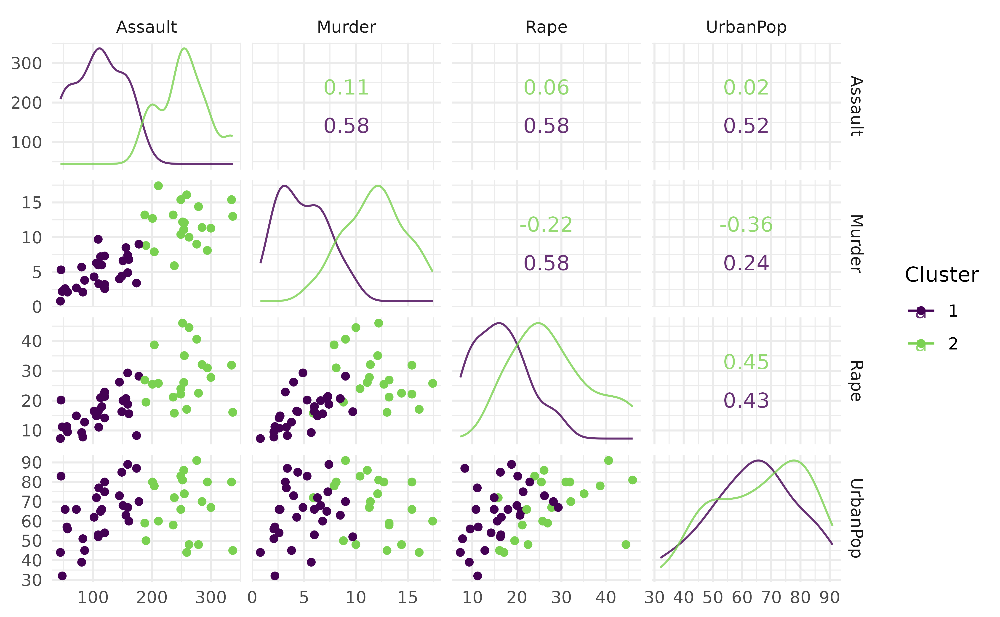
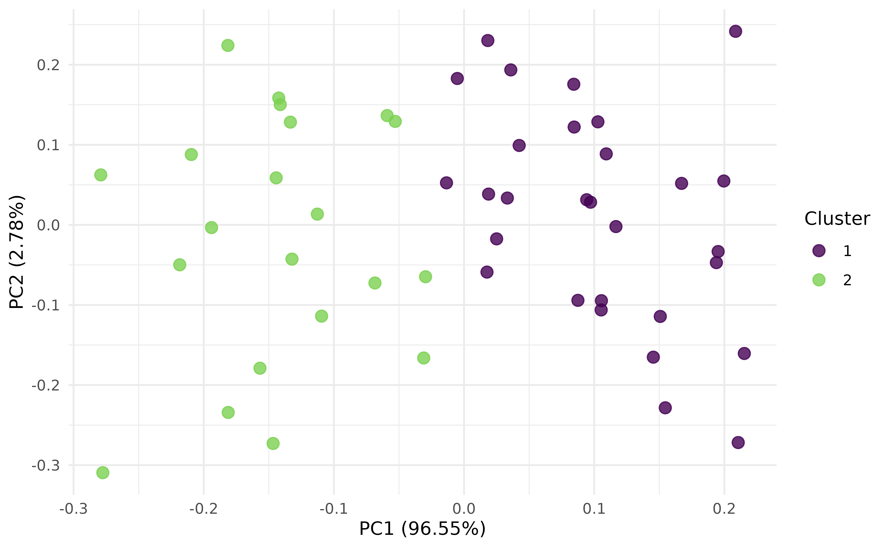
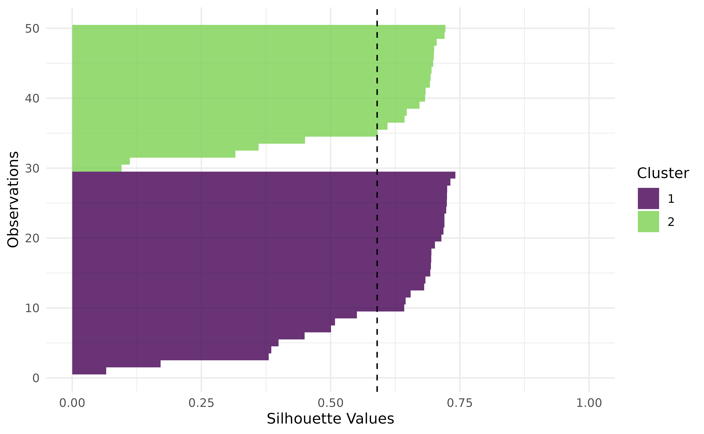

# mlr3 Integration

This vignette demonstrates how to integrate the G-Means algorithm with
the [mlr3](https://mlr3.mlr-org.com/) framework for
[clustering](https://mlr3cluster.mlr-org.com/). G-Means extends k-means
by adapting the number of clusters based on statistical tests.

We’ll start by loading the necessary libraries:

``` r
library(gmeans)
library(mlr3cluster)
library(mlr3misc)
library(mlr3viz)
library(paradox)
```

We define a custom `LearnerClustGMeans` class by extending the
\[mlr3cluster::LearnerClust\] class for G-Means clustering.

``` r
LearnerClustGMeans <- R6::R6Class("LearnerClustGMeans",
  inherit = LearnerClust,
  public = list(
    initialize = function() {
      param_set <- ps(
        k_init = p_int(2L, default = 2L, tags = "train"),
        k_max = p_int(2L, default = 10L, tags = "train"),
        level = p_dbl(0, 1, default = 0.05, tags = "train"),
        iter.max = p_int(1L, default = 10L, tags = "train"),
        algorithm = p_fct(
          levels = c("Hartigan-Wong", "Lloyd", "Forgy", "MacQueen"),
          default = "Hartigan-Wong",
          tags = "train"
        ),
        trace = p_lgl(default = FALSE, tags = "train")
      )

      super$initialize(
        id = "clust.gmeans",
        feature_types = c("logical", "integer", "numeric"),
        predict_types = "partition",
        param_set = param_set,
        properties = c("partitional", "exclusive", "complete"),
        packages = "gmeans",
        man = "mlr3cluster::mlr_learners_clust.gmeans",
        label = "G-Means"
      )
    }
  ),
  private = list(
    .train = function(task) {
      pv <- self$param_set$get_values(tags = "train")
      m <- invoke(gmeans::gmeans, x = task$data(), .args = pv)
      if (self$save_assignments) {
        self$assignments <- m$cluster
      }
      m
    },
    .predict = function(task) {
      partition <- invoke(predict, self$model,
        newdata = task$data(), type = "class_ids"
      )
      PredictionClust$new(task = task, partition = partition)
    }
  )
)

mlr_learners$add("clust.gmeans", LearnerClustGMeans)
```

We create a clustering task using the `usarrests` dataset and train the
G-Means learner.

``` r
task <- tsk("usarrests")
learner <- lrn("clust.gmeans")
learner$train(task)
prediction <- learner$predict(task = task)
prediction
#> 
#> ── <PredictionClust> for 50 observations: ──────────────────────────────────────
#>  row_ids partition
#>        1         2
#>        2         2
#>        3         2
#>      ---       ---
#>       48         1
#>       49         1
#>       50         1
```

We use
[`autoplot()`](https://ggplot2.tidyverse.org/reference/autoplot.html) to
visualize the clusters produced by the G-Means learner. This provides a
simple scatter plot of the cluster assignments.

``` r
autoplot(prediction, task)
```



We calculate performance metrics such as within-cluster sum of squares
(`clust.wss`) and silhouette width (`clust.silhouette`), which measure
cluster compactness and separation, respectively.

``` r
measures <- msrs(c("clust.wss", "clust.silhouette"))
prediction$score(measures, task)
#>        clust.wss clust.silhouette 
#>     9.639903e+04     5.926554e-01
```

Alternatively, evaluate the clustering with PCA (Principal Component
Analysis) and Silhouette plots:

``` r
autoplot(prediction, task, type = "pca")
#> Warning: `aes_string()` was deprecated in ggplot2 3.0.0.
#> ℹ Please use tidy evaluation idioms with `aes()`.
#> ℹ See also `vignette("ggplot2-in-packages")` for more information.
#> ℹ The deprecated feature was likely used in the ggfortify package.
#>   Please report the issue at <https://github.com/sinhrks/ggfortify/issues>.
#> This warning is displayed once every 8 hours.
#> Call `lifecycle::last_lifecycle_warnings()` to see where this warning was
#> generated.
```



``` r
autoplot(prediction, task, type = "sil")
#> Warning: Using `size` aesthetic for lines was deprecated in ggplot2 3.4.0.
#> ℹ Please use `linewidth` instead.
#> ℹ The deprecated feature was likely used in the ggfortify package.
#>   Please report the issue at <https://github.com/sinhrks/ggfortify/issues>.
#> This warning is displayed once every 8 hours.
#> Call `lifecycle::last_lifecycle_warnings()` to see where this warning was
#> generated.
```



Lastly, we can now easily run a benchmark experiment to compare G-Means
with other clustering algorithms.

``` r
learners <- list(
  lrn("clust.featureless"),
  lrn("clust.kmeans"),
  lrn("clust.gmeans")
)
measures <- list(msr("clust.wss"), msr("clust.silhouette"))
bmr <- benchmark(benchmark_grid(tsk("ruspini"), learners, rsmp("insample")))
bmr$aggregate(measures)[, c(4, 7, 8)]
#>           learner_id  clust.wss clust.silhouette
#>               <char>      <num>            <num>
#> 1: clust.featureless 244373.867        0.0000000
#> 2:      clust.kmeans  89337.832        0.5827264
#> 3:      clust.gmeans   7680.413        0.5668791
```
